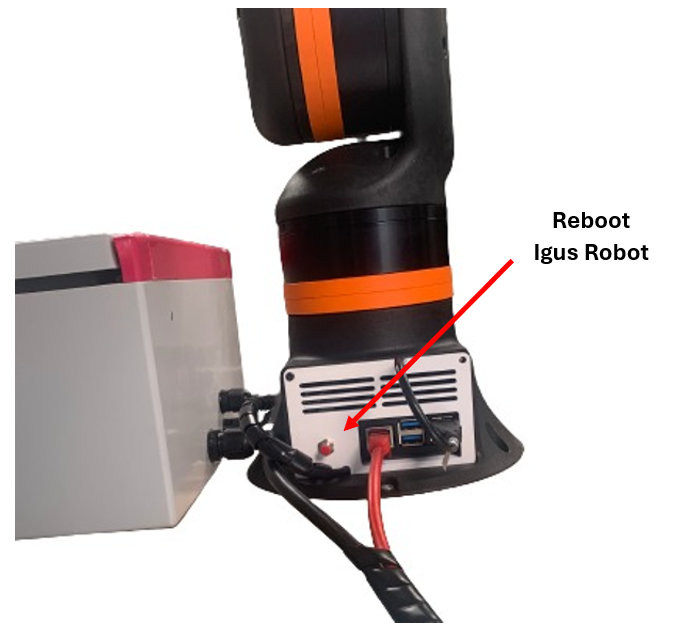

# igus_rebel_on_sew_agv

## Table of Contents
1. [Overview](#overview)
2. [Video](#video)
3. [How to use the AGV and the robot](#howto)

<a name="overview"/>

## Overview
 

This is our main repository for the Igus Rebel robot (open source variant) on a SEW AGV. It was developed by Hannes Bornemann, Robin Wolf, and Mathias Fuhrer as part of a project at Karlsruhe University of Applied Sciences.

All the ROS2 packages related to this project can be found in the [ros2-packages](https://github.com/mathias31415/igus_rebel_on_sew_agv/tree/main/ros2-packages) folder. For easy deployment we used docker containers for all our implementations.

### [sew_maxo_mts_ros2](https://github.com/RobinWolf/sew_maxo_mts_ros2/tree/dev)
This repository contains the code for controlling the SEW AGV using an Xbox joystick or keyboard.

### [igus_rebel_ros2_docker](https://github.com/mathias31415/igus_rebel_ros2_docker)
This repository contains the code for controlling the Igus Rebel robot mounted on the AGV via RViz.

### [sew_maxo_mts_and_igus_rebel](https://github.com/RobinWolf/sew_maxo_mts_and_igus_rebel)
This repository contains the Gazebo simulation for simulating the AGV with the robot picking boxes in a simulated warehouse.

For more detailed documentation, please refer to the README files of the respective repositories or visit our (German) [documentation]().


<a name="video"/>

## Video
This [YouTube video]() shows the results of our project work:

TODO

<a name="howto"/>

## How to use the AGV and the robot
To use the AGV with the robot, the AGV and the robot must be turned on in the specified order. The Raspberry Pi, located in the base of the robot, automatically sets everything up and launches the ROS packages. Once the Raspberry Pi has finished booting, you can connect to the Wi-Fi created by the Raspberry Pi using another PC running Ubuntu. On the PC, you can then build and start the two Docker containers. An internet connection is required during the build process. Therefore, you should only connect to the Raspberry Pi's Wi-Fi after the build. In the `igus_rebel_ros2_docker` Docker container, RViz must be started, and in the `sew_maxo_mts_ros2` Docker container, the launch file for the joystick must be launched. To turn off the robot and the AGV, the specified order must be followed again.

### 1. Turn on the AGV and the robot

 

1. Make sure the robot main switch is turned off (Note: The off position is the vertical switch position ( | ) and the on position is the horizontal switch position ( – )).
2. Pull the AGV emergency stop.
3. Turn on the AGV by pressing and holding the green and blue buttons for a few seconds.
4. The display will turn on and the green button will light up.
5. Release the robot emergency stop if it is pressed.
6. Turn on the robot main switch.
7. Once the Raspberry Pi has fully booted, the `AGV` Wi-Fi will be visible, the green button will no longer be lit, and the display will show `RC` in a blue box at the bottom right. The robot will make a quiet humming sound and activate the individual axes, which can be heard as a clicking sound.
8. If there are any errors, the Raspberry Pi can be rebooted using the reboot button in the robot base. A reboot is also necessary if the robot emergency stop has been activated.

### 2. Build and start the Docker containers
1. Clone the two repositories:
```
git clone https://github.com/mathias31415/igus_rebel_ros2_docker.git
git clone https://github.com/RobinWolf/sew_maxo_mts_ros2.git
```
(Make sure you are on the correct branch (use `git checkout <branchname>`))

2. Build and start the two Docker containers by navigating to the respective directories (using `cd`) and then executing the scripts to build and start the containers. You need to be connected to the internet for this.
```
./build_docker.sh
./start_docker.sh
```
3. Exit the respective Docker container by pressing `CTRL` + `C`. The Docker container will continue running in the background.


### 3. Connect to the Raspberry Pi's Wi-Fi
Connect your PC to the `AGV` Wi-Fi created by the Raspberry Pi. The password is `agv12345`.

### 4. Start RViz in the `igus_rebel_ros2_docker` Docker container
1. Reconnect to the `igus_rebel_ros2_docker` Docker container
```
docker exec -it igus_rebel bash
```
2. Source 
```
source install/setup.bash
```
3. Start RViz 
```
ros2 launch irc_ros_bringup rviz.launch.py
```
You can now use RViz to move the robot arm.

### 5. Use the joystick in the `sew_maxo_mts_ros2` Docker container
1. Reconnect to the `sew_maxo_mts_ros2` Docker container (in a second terminal)
```
docker exec -it sew_navigation bash
```
2. Source 
```
source install/setup.bash
```
3. Launch the joystick launch file 
```
ros2 launch sew_agv_navigation joystick.launch.py
```

### 6. Turn off the AGV and the robot
1. Press the robot emergency stop to cut the 24V power supply from the robot (the logic voltage remains).
2. Turn off the robot main switch.
3. Push the AGV emergency stop.
4. Turn off the AGV by pressing and holding the green and blue buttons for a few seconds.
5. The display will turn off and the buttons will stop lighting up.

